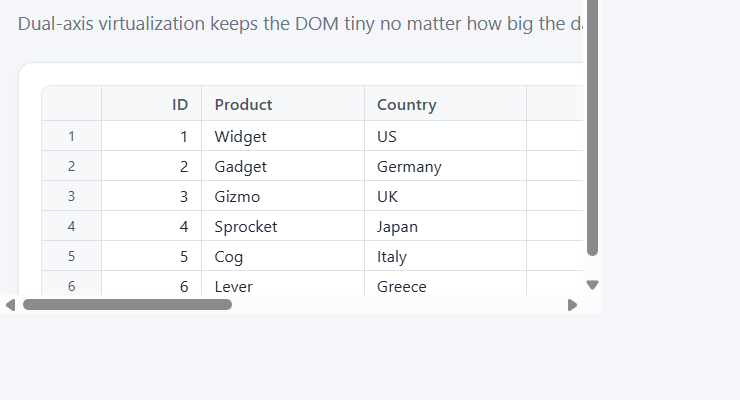
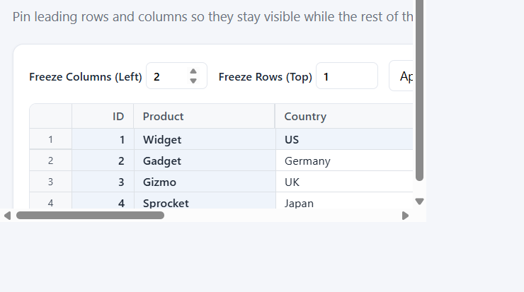
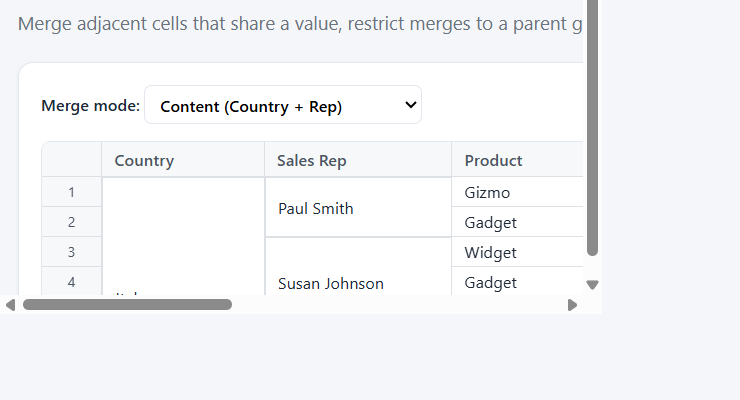
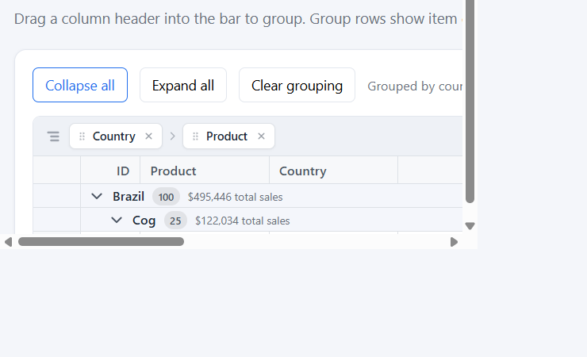
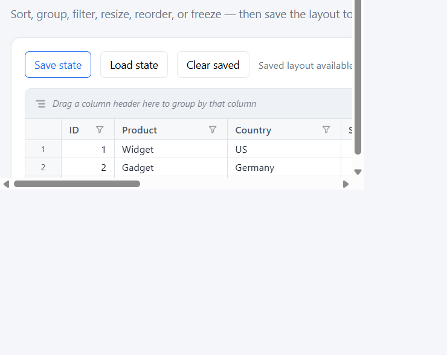

# @avi-pathak/apgrid

A fast, framework-free **virtualized data grid** for the web. Renders 1,000,000+ rows
with a recycled DOM, modeled on the architecture of commercial data grids.



## Features

- Dual-axis virtualization (millions of rows, hundreds of columns) at ~60fps
- Recycled DOM — node count tracks the viewport, not the dataset
- Row + column headers with pinned corner; full-span scrollbars
- **Frozen rows & columns** — pin leading rows/columns while the rest scrolls
- **Cell merging / spanning** — content-driven, custom, or restricted merge rules
- **Grouping** with a drag-to-group bar, group totals, and collapse/expand
- **Sorting**, **column filtering**, column **resize** and **reorder**
- **Conditional styling** — per-cell and per-row classes and styles
- **Save & load state** — `toJSON()` / `loadJSON()` round-trip the whole layout
- Selection modes: None, Cell, CellRange, Row, RowRange, Column, ColumnRange
- Cell editing, clipboard, and full **undo / redo** (Ctrl+Z / Ctrl+Y)
- Zero runtime dependencies; ships ESM, CJS, and UMD with type declarations

## Install

```bash
npm install @avi-pathak/apgrid
```

## Usage

```ts
import { Grid } from '@avi-pathak/apgrid';
import '@avi-pathak/apgrid/styles.css';

const grid = new Grid('#theGrid', {
  columns: [
    { binding: 'id', header: 'ID', width: 60 },
    { binding: 'country', header: 'Country', width: 140 },
    { binding: 'sales', header: 'Sales', width: 120, editable: true },
  ],
  itemsSource: data,
  selectionMode: 'CellRange',
});
```

## Highlights

### Frozen rows & columns

Pin leading rows and columns so they stay visible while the rest of the grid scrolls.

```ts
new Grid('#grid', { columns, itemsSource, frozenColumns: 2, frozenRows: 1 });
// or at runtime:
grid.freezeColumns(2);
grid.freezeRows(1);
```



### Cell merging

Merge adjacent cells that share a value, or supply a custom `mergeManager` for
restricted or fully custom rules.

```ts
new Grid('#grid', {
  columns: [{ binding: 'country', allowMerging: true } /* ... */],
  itemsSource,
  allowMerging: true,
});
```



### Grouping

Drag a column into the group bar (or call `grid.groupBy('country', 'product')`).
Group rows show item counts and column totals.



### Save & load state

Capture the full layout — column order and widths, sort, filters, grouping and
collapsed groups, frozen rows/columns, selection, and scroll — then restore it.

```ts
const snapshot = grid.toJSON();
localStorage.setItem('grid-state', JSON.stringify(snapshot));

// later…
grid.loadJSON(JSON.parse(localStorage.getItem('grid-state')!));
```



## Scripts

`npm run dev` · `npm run build` · `npm test` · `npm run typecheck` · `npm run lint`

## Docs

See [docs/](./docs/) — architecture, rendering, virtualization, interaction, build,
testing, roadmap, and the [API reference](./docs/API-Reference.md).
