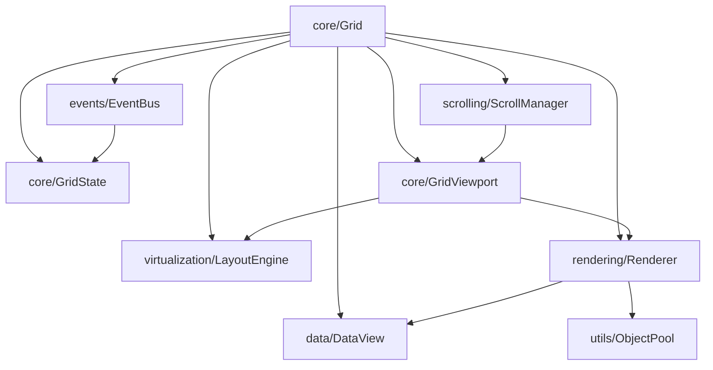
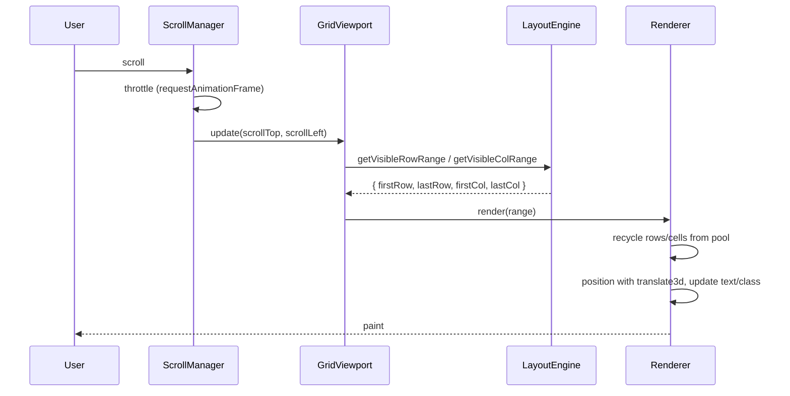

# 01 — Architecture

> `@avi-pathak/apgrid` — a virtualized data grid for the web.

This document is the system overview: the goals, the layered design, and how the
subsystems fit together. The remaining numbered documents drill into each layer.

## Goals

- Render very large datasets (1,000,000+ rows, 100+ columns) at ~60fps.
- Keep the DOM small. Node count tracks the **viewport**, never the dataset.
- Stay framework-free and dependency-free at runtime. Ship ESM, CJS, and UMD.
- Be extensible: selection, editing, sorting, frozen panes, etc. plug in without
  rewriting the core.

## Non-goals (v1)

- No built-in charts, pivot, tree grid, or formula engine.
- No React/Vue/Angular wrappers yet (the core is framework-agnostic so they can be
  added later as thin adapters).
- No clipboard or undo/redo in v1, but the event and command seams are left open.

## Design principles

1. **One responsibility per class.** A renderer renders; it does not listen to
   scroll events or mutate data.
2. **Data flows one direction.** Input → state → subsystems → DOM. Subsystems read
   state and request changes through methods; they never reach into each other.
3. **No hidden globals.** Everything a subsystem needs is injected through its
   constructor (the `Grid` is the composition root).
4. **Virtualize with math, not loops.** Visible ranges come from cumulative offset
   arrays and binary search — never by walking from row 0.
5. **Recycle the DOM.** Cells and rows come from object pools and are repositioned
   with `transform`, not recreated on every scroll.

## Layered architecture



Reading the graph top-down: the `Grid` composes everything. A scroll produces a new
viewport, the viewport asks the layout engine which rows/columns are visible, and the
renderer recycles DOM nodes to fill that window using data from the `DataView`.

### The layers

| Layer | Folder | Responsibility |
| --- | --- | --- |
| Core | `core/` | Composition, options, centralized state, viewport math |
| Models | `models/` | Plain shapes for `Column`, `Row`, `Cell` |
| Data | `data/` | Abstraction over the user's `itemsSource` |
| Virtualization | `virtualization/` | Offsets, totals, visible ranges, pooled windows |
| Rendering | `rendering/` | Build and update DOM for the visible window |
| Scrolling | `scrolling/` | Listen to scroll, throttle with rAF, position content |
| Events | `events/` | Typed pub/sub, mouse/keyboard/focus handlers |
| Selection | `selection/` | Selection model, independent of rendering |
| Editing | `editing/` | Editor lifecycle and editor registry |
| Utils | `utils/` | DOM helpers, math, binary search, object pool |
| Styles | `styles/` | Themeable CSS using custom properties |

## Render pipeline



The pipeline does no work proportional to the dataset. On a scroll it touches only
the cells entering or leaving the buffered window.

## Public API at a glance

```ts
import { Grid } from '@avi-pathak/apgrid';
import '@avi-pathak/apgrid/styles.css';

const grid = new Grid('#theGrid', {
  columns: [
    { binding: 'id', header: 'ID', width: 60 },
    { binding: 'country', header: 'Country', width: 120 },
    { binding: 'sales', header: 'Sales', width: 100 },
  ],
  itemsSource: data,
});

grid.scrollTo(5000);
grid.select(10, 1);
grid.dispose();
```

The constructor and column shape stay close to the original proof-of-concept so
existing users migrate with minimal changes. `dataSource` is accepted as an alias
for `itemsSource`.

## Where to go next

- Core engine and state — [02-Core-Engine.md](./02-Core-Engine.md)
- Rendering internals — [03-Rendering.md](./03-Rendering.md)
- Virtualization algorithms — [04-Virtualization.md](./04-Virtualization.md)
- Interaction (selection, editing, keyboard) — [05-Interaction.md](./05-Interaction.md)
- Data layer — [06-Data-Layer.md](./06-Data-Layer.md)
- Build & packaging — [07-Build-System.md](./07-Build-System.md)
- Testing — [08-Testing.md](./08-Testing.md)
- Roadmap — [09-Roadmap.md](./09-Roadmap.md)
- API reference — [API-Reference.md](./API-Reference.md)
