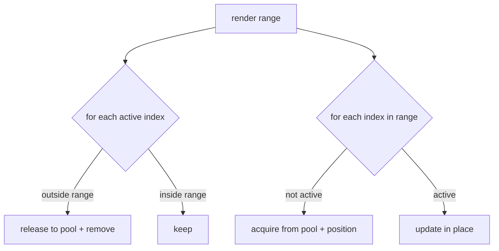

# 03 — Rendering

The rendering layer turns a visible range into DOM and keeps that DOM small by
recycling elements. Nothing here knows about scroll events or data sources — it
just draws whatever range the [viewport](./02-Core-Engine.md) reports.

## DOM scaffold

[`ViewportRenderer`](../src/rendering/ViewportRenderer.ts) builds a fixed structure
once:

```
.apg                     host (flex column)
├── .apg-header          clipped, fixed height
│   └── .apg-header-inner sized to total width, translated by -scrollLeft
│       └── .apg-header-cell × visible columns
└── .apg-viewport        the scroll container (overflow: auto)
    └── .apg-canvas       sized to totalWidth × totalHeight
        └── .apg-row × visible rows
            └── .apg-cell × visible columns
```

The **canvas** carries the full content size, so the browser shows correct native
scrollbars even though only a few rows exist. Rows are absolutely positioned inside
it at their real offset, so the native scroll moves them for free.

The **header** sits outside the scroll container and is translated horizontally to
match `scrollLeft`, so it scrolls sideways with the body but never vertically.

## Recycling model

Each renderer keeps a `Map<index, element>` of what's currently on screen and an
[`ObjectPool`](../src/utils/ObjectPool.ts) of spare elements. A render pass is a diff:



- [`RowRenderer`](../src/rendering/RowRenderer.ts) does this for rows, and inside each
  row does the same diff for its cells against the visible column range.
- [`HeaderRenderer`](../src/rendering/HeaderRenderer.ts) does it for header cells.

Because a row's vertical offset is `index * rowHeight`, a row that stays in range is
never touched. Only rows entering or leaving the window do any work. That's what keeps
a scroll cheap regardless of dataset size.

## Positioning

| Element | Positioned by |
| --- | --- |
| Row | `transform: translate3d(0, rowTop)` — set when (re)assigned an index |
| Cell | `left` + `width` — only changes when the column range shifts |
| Header inner | `transform: translate3d(-scrollLeft, 0)` |

`transform` is used for the things that move during scrolling (rows, header) so the
browser can composite them without re-running layout. Static within-row positions use
`left`. Zebra striping is a class (`apg-row-alt`) toggled from the row **index**, not a
CSS `nth-child`, because pooled rows don't keep DOM order.

## Render context

Renderers hold no reference to the data or layout. Each pass receives a fresh
[`RenderContext`](../src/rendering/RenderContext.ts):

```ts
interface RenderContext {
  layout: LayoutEngine;
  columns: Column[];
  data: DataView;
  state: GridState;
}
```

So when the grid swaps data or columns, the next `render(ctx)` simply uses the new
context — there's no cached state to invalidate.

## Cell content

Cell text comes from the column, not the renderer:

```ts
cell.textContent = column.format(item); // valueFormatter ?? String(valueGetter ?? item[binding])
```

Custom `cellRenderer` hooks (DOM instead of text) layer on top of this in a later phase
without changing the recycling logic.

## What this buys us

A test in [Renderer.test.ts](../src/rendering/Renderer.test.ts) jumps 500,000 rows and
asserts the DOM never exceeds the visible window (< 30 rows). The same test patches
`document.createElement` to prove scrolling 200 rows allocates far fewer than 200 rows
of DOM — the pool is doing its job.
