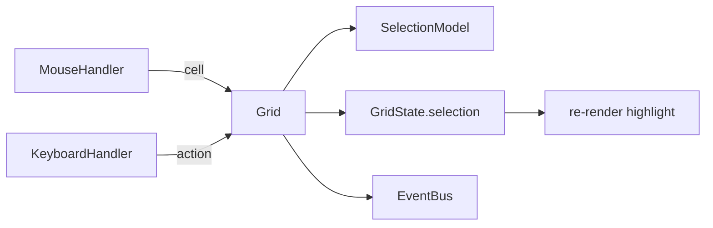

# 05 — Interaction

How the grid turns mouse and keyboard input into selection and events. Input
handlers are thin: they translate DOM events into grid coordinates and hand off to
the [`Grid`](../src/core/Grid.ts), which owns the decisions.



## Selection

[`SelectionModel`](../src/selection/SelectionModel.ts) tracks an **active cell** and
the **anchor** it extends from. The highlighted rectangle is derived from those plus
the mode, so the active cell keeps its real column even in Row mode (where the whole
row highlights).

Selection is **independent of rendering**: the model knows nothing about DOM. The
renderer reads `state.selection` (the rectangle) and `state.activeCell` while filling
cells, toggling `apg-cell-selected` and `apg-cell-active`. Because that runs on every
cell update, a recycled cell shows the right highlight no matter which row it was
pooled from.

### Selection modes

Modeled after Wijmo FlexGrid's `SelectionMode`. Set it with the `selectionMode`
option or the `grid.selectionMode` property:

| Mode | Behavior |
| --- | --- |
| `None` | Selection disabled |
| `Cell` | A single cell (default) |
| `CellRange` | A contiguous block of cells (drag / shift) |
| `Row` | A single full-width row |
| `RowRange` | Contiguous full-width rows |
| `Column` | A single full-height column |
| `ColumnRange` | Contiguous full-height columns |

```ts
const grid = new Grid('#grid', { columns, itemsSource, selectionMode: 'CellRange' });
grid.selectionMode = 'Row'; // change at runtime
grid.selection;             // the highlighted CellRange, or null
grid.selectedCell;          // the active cell address, or null
```

`Cell`/`Row`/`Column` are single-item modes; the `*Range` variants extend to a
contiguous block. Non-contiguous selection (FlexGrid's `ListBox`/`MultiRange`,
ctrl+click) is intentionally **not** in v1 — the anchor/active model leaves room for
it later.

### Mouse

[`MouseHandler`](../src/events/MouseHandler.ts) hit-tests a press against the layout:

```ts
const x = e.clientX - rect.left + viewport.scrollLeft;
const y = e.clientY - rect.top + viewport.scrollTop;
return { row: layout.rowAtY(y), col: layout.colAtX(x) };
```

`rowAtY` is O(1) division; `colAtX` is a binary search over the column offsets — the
same math the viewport uses, reused for pointer coordinates. A press selects; holding
the button and moving, or shift+clicking, **extends** the selection (the grid applies
the mode's constraints). `cellClick` fires on the press only, not during a drag.

### Keyboard

[`KeyboardHandler`](../src/events/KeyboardHandler.ts) maps navigation keys to actions
and forwards the shift state; the grid applies them to the active cell:

| Key | Action |
| --- | --- |
| Arrows | Move one cell |
| Shift + arrows | Extend the selection (range modes) |
| Home / End | First / last column |
| PageUp / PageDown | Move by a viewport of rows |

After moving, the grid calls `scrollIntoView` so the active cell never leaves the
visible area. The host gets `tabindex="0"` so it can receive key events, with a
`:focus-visible` outline for keyboard users.

### Header feedback

The column header highlights to echo the selection: the spanned columns for
`CellRange`/`Column`/`ColumnRange`, or just the current column for cell and row
modes (there are no row headers to mark in `Row` mode).

## Events

[`EventBus`](../src/events/EventBus.ts) is a small typed pub/sub. The event names and
payloads are declared once in [`GridEvents`](../src/events/GridEvents.ts):

```ts
interface GridEvents {
  cellClick: CellAddress;
  cellDoubleClick: CellAddress;
  selectionChanged: CellAddress | null;
  scrollChanged: { scrollTop: number; scrollLeft: number };
}
```

Subscribe through the grid; the returned function unsubscribes:

```ts
const off = grid.on('selectionChanged', (cell) => console.log(cell));
off();
```

`dispose()` clears all handlers, removes the input listeners, and drops the
`tabindex`, so a disposed grid leaks nothing.

## Deferred

- **Non-contiguous selection** (FlexGrid `ListBox`/`MultiRange`, ctrl+click): would
  store a list of ranges instead of one. The anchor/active model is ready for it.
- **FocusManager**: focus currently tracks selection on the host element; a dedicated
  manager arrives if focus and selection need to diverge (e.g. during editing).
