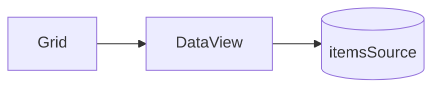

# 06 — Data Layer

The grid never reads the user's array directly. Every row is fetched through the
data layer, which gives us one place to add sorting, filtering, grouping, and
remote loading later without touching the renderer.



## DataView

[`DataView`](../src/data/DataView.ts) is the read interface the rest of the grid
uses. In v1 it's a thin window over an in-memory array:

```ts
class DataView<T> {
  get length(): number;
  item(index: number): T;
  setItems(items: T[]): void;
}
```

The renderer asks for `view.item(rowIndex)` and `view.length` — nothing more. That
small surface is the whole point: as long as a data source can answer "how many
rows" and "give me row N", the renderer doesn't care where the data came from.

### Value resolution

A row is a plain object; turning it into cell text is the **column's** job, not the
DataView's. Each [`Column`](../src/models/Column.ts) resolves and formats:

```ts
column.getValue(item);   // valueGetter(item) ?? item[binding]
column.format(item);     // valueFormatter(value, item) ?? String(value)
```

This split keeps data access (DataView) separate from presentation (Column), so a
formatter change never risks the data path.

## What's intentionally not here yet

The following are designed for but **not built in v1** — they slot in behind the
same `DataView` interface so the renderer stays untouched:

| Feature | How it will fit |
| --- | --- |
| Sorting | A `CollectionView` maps view indices → source indices |
| Filtering | Same index map, with rows excluded |
| Grouping | View exposes group rows alongside data rows |
| Remote / async | `item(index)` returns a placeholder until the page loads |

The key invariant: **the renderer only ever sees view indices `0..length-1`.** All
ordering and filtering happens behind `DataView`, so virtualization and rendering
never need to know about it.

## Mutation

`setItems(items)` replaces the backing array. The `Grid` calls it from `setData()`
and then triggers a refresh — the DataView itself doesn't emit events in v1 because
the grid orchestrates the redraw. Change notification gets added when sorting makes
the view update independently of an explicit `setData`.
